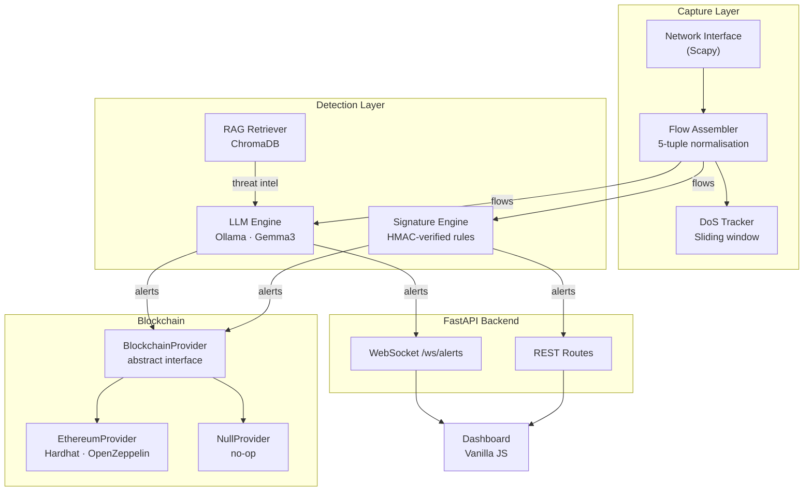

# marmot-nids

[](https://github.com/wxnkai/marmot-nids/actions/workflows/ci.yml)
[](https://www.python.org/downloads/)
[](LICENSE)
[](https://github.com/astral-sh/ruff)
[]()

> [!CAUTION]
> **Educational Portfolio Project** — This system is built to showcase cybersecurity
> engineering skills. It is **NOT** intended for production deployment and has not been
> independently audited. Do not use it to protect real networks or infrastructure.

---

**marmot-nids** is a modular Network Intrusion Detection System that combines
real-time 5-tuple flow assembly, HMAC-verified signature detection, local LLM-based
contextual threat analysis (via Ollama + Gemma3), and pluggable blockchain audit
logging on a private Ethereum chain — built to production standards with FastAPI,
Pydantic v2, and OpenZeppelin smart contracts.

---

## Table of Contents

- [Architecture](#architecture)
- [Four Pillars](#four-pillars)
- [Quickstart](#quickstart)
- [Configuration Reference](#configuration-reference)
- [Detection Capabilities](#detection-capabilities)
- [Blockchain Providers](#blockchain-providers)
- [Project Structure](#project-structure)
- [Security](#security)

---

## Architecture



---

## Four Pillars

### 1 — Network Traffic Analysis & Flow Engineering

Packets are captured from the wire using Scapy and assembled into bidirectional
5-tuple flows `(src_ip, dst_ip, src_port, dst_port, protocol)`. The flow key is
normalised by sorting the address pair so that A→B and B→A packets contribute to
the same flow record. Per-flow statistics (packet count, byte count, IAT, flag
counters, payload length distribution) are maintained in a bounded ring buffer.

A sliding-window DoS tracker counts protocol-specific event rates (SYN packets, ICMP
packets, RST packets) and fires pre-detection alerts before flows are fully assembled,
enabling early reaction to volumetric attacks.

### 2 — Signature Detection Engine

Signatures are defined in `signatures/signatures.json` as typed Pydantic-validated
records. The file's integrity is verified on every load using HMAC-SHA256 — if
`signatures.json` has been modified without re-signing, the engine raises
`SignatureLoadError` and refuses to start.

Conditions are evaluated using six comparison operators (`>=`, `<=`, `>`, `<`, `==`,
`!=`) against flow statistics fields (packet count, byte count, SYN ratio, RST ratio,
duration, IAT, port numbers, flag counts). All conditions in a signature use AND
semantics — every condition must match for the rule to fire.

Signatures are protocol-indexed on load, so evaluation cost scales with the number
of rules relevant to the observed protocol — not the total rule count.

### 3 — LLM + RAG Contextual Analysis

A local Ollama instance runs Gemma3 entirely offline — no network traffic data is
ever sent to a third-party API (see [ADR-002](docs/adr/002-local-llm-ollama.md)).

Flow batches are queued and submitted to the LLM with a structured prompt:
`system role → RAG context (ChromaDB threat intel) → flow statistics → JSON output
schema`. The output schema is injected as an explicit contract; all responses are
validated through Pydantic before any field is accessed. Malformed LLM output is
handled gracefully — a `ParseResult(success=False)` is returned, never a raised
exception.

The RAG knowledge base covers DoS/DDoS patterns, port scanning techniques, brute
force indicators, web application attacks, DNS-based attacks, lateral movement, normal
traffic baselines, and MITRE ATT&CK mappings.

### 4 — Blockchain Audit Logging

Alerts are optionally committed to an Ethereum-compatible chain via the
`AlertRegistry` smart contract (Solidity ^0.8.24, OpenZeppelin `Ownable`). Only
the deployer account can call `logAlert()` — a vulnerability present in the original
FYP that has been explicitly fixed here (see [ADR-001](docs/adr/001-pluggable-blockchain.md)).

The provider is pluggable: set `BLOCKCHAIN_PROVIDER=none` for development (NullProvider
— no crash, alerts only) or `BLOCKCHAIN_PROVIDER=ethereum` for chain logging.
A background sync task batches unsynced alerts for submission.

---

## Quickstart

### Prerequisites

- Python 3.13+
- [Npcap](https://npcap.com/) (Windows) or libpcap (Linux) for packet capture
- [Ollama](https://ollama.com/) with `gemma3` pulled (optional, for LLM detection)
- Docker 24+ and Docker Compose v2 (optional, for containerised deployment)

### Local Setup (Windows)

```powershell
git clone https://github.com/wxnkai/marmot-nids.git
cd marmot-nids

python -m venv .venv
.venv\Scripts\activate

pip install pydantic python-decouple httpx fastapi uvicorn websockets scapy
pip install pytest pytest-asyncio

copy .env.example .env
# Edit .env — set SIGNATURE_HMAC_SECRET at minimum

# Run tests to verify setup
pytest

# Start the API server
uvicorn core.api.app:create_app --factory --host 0.0.0.0 --port 8000
```

### Docker Compose

```bash
cp .env.example .env
# Edit .env — set SIGNATURE_HMAC_SECRET

docker compose up                        # NIDS + Ollama
docker compose --profile blockchain up   # + Hardhat node
```

Services:

| URL | Description |
|-----|-------------|
| `http://localhost:8000/api/docs` | FastAPI OpenAPI documentation |
| `http://localhost:8000/api/health` | Health check endpoint |
| `http://localhost:11434` | Ollama API |
| `http://localhost:8545` | Hardhat JSON-RPC endpoint (blockchain profile) |

---

## Configuration Reference

All settings are read via `python-decouple` from `.env`. See
[.env.example](.env.example) for the full reference with descriptions and defaults.

Key variables:

| Variable | Required | Default | Description |
|----------|----------|---------|-------------|
| `SIGNATURE_HMAC_SECRET` | **Yes** | — | HMAC key for signature file integrity |
| `CAPTURE_INTERFACE` | For capture | — | Network interface name (e.g. `Ethernet`, `eth0`) |
| `OLLAMA_BASE_URL` | No | `http://localhost:11434` | Ollama API endpoint |
| `LLM_MODEL` | No | `gemma3` | Ollama model name |
| `LLM_CONFIDENCE_THRESHOLD` | No | `0.6` | Minimum confidence for LLM alerts |
| `BLOCKCHAIN_PROVIDER` | No | `none` | `ethereum` or `none` |
| `ETHEREUM_PRIVATE_KEY` | When `ethereum` | — | Deployer account private key |
| `CONTRACT_ADDRESS` | When `ethereum` | — | Deployed AlertRegistry address |
| `LOG_LEVEL` | No | `INFO` | `DEBUG`, `INFO`, `WARNING`, `ERROR`, `CRITICAL` |

See [.env.example](.env.example) for all 30+ configuration variables.

---

## Detection Capabilities

| Attack Type | Category | Signature | LLM | MITRE ATT&CK |
|-------------|----------|:---------:|:---:|--------------|
| SYN Flood | DoS/DDoS | ✓ | ✓ | T1498.001 |
| RST Flood | DoS/DDoS | ✓ | ✓ | T1498 |
| ICMP Flood | DoS/DDoS | ✓ | ✓ | T1498.001 |
| UDP Flood | DoS/DDoS | ✓ | ✓ | T1498.001 |
| DNS Amplification | DoS/DDoS | ✓ | ✓ | T1498.002 |
| NULL Scan | Reconnaissance | ✓ | ✓ | T1046 |
| FIN Scan | Reconnaissance | ✓ | ✓ | T1046 |
| XMAS Scan | Reconnaissance | ✓ | ✓ | T1046 |
| Port Scan (Horizontal) | Reconnaissance | ✓ | ✓ | T1046 |
| Port Scan (Vertical) | Reconnaissance | ✓ | ✓ | T1046 |
| SSH Brute Force | Credential Access | ✓ | ✓ | T1110.001 |
| HTTP Brute Force | Credential Access | ✓ | ✓ | T1110.001 |
| DNS Tunnelling | Exfiltration | — | ✓ | T1048.003 |
| Lateral Movement | Lateral Movement | — | ✓ | T1021 |

Signature = HMAC-verified condition-based rule in `signatures/signatures.json`
LLM = Gemma3 contextual analysis with RAG-injected threat intelligence

---

## Blockchain Providers

| Provider | `BLOCKCHAIN_PROVIDER` | Description |
|----------|----------------------|-------------|
| `NullProvider` | `none` (default) | No-op — alerts are not logged on-chain. For development and CI. |
| `EthereumProvider` | `ethereum` | Submits alerts to an Ethereum-compatible node via web3.py. |

---

## Project Structure

```
marmot-nids/
├── core/
│   ├── api/
│   │   ├── app.py                  # FastAPI application factory + lifespan
│   │   └── routes/
│   │       ├── alerts.py           # Alert list, detail, stats endpoints
│   │       ├── health.py           # Health check endpoint
│   │       ├── status.py           # System status endpoint
│   │       └── ws.py               # WebSocket alert streaming
│   │
│   ├── blockchain/
│   │   ├── provider.py             # Abstract BlockchainProvider + types
│   │   ├── ethereum.py             # EthereumProvider (web3.py)
│   │   ├── null_provider.py        # NullProvider (no-op)
│   │   ├── factory.py              # Env-driven provider selection
│   │   └── sync.py                 # Background alert sync task
│   │
│   ├── capture/
│   │   ├── sniffer.py              # Scapy packet capture loop
│   │   ├── flow_assembler.py       # Bidirectional 5-tuple flow assembly
│   │   ├── flow_stats.py           # Per-flow statistical accumulators
│   │   └── dos_tracker.py          # Sliding-window DoS detection
│   │
│   └── detection/
│       ├── base.py                 # Abstract DetectionEngine + Alert
│       ├── signature/
│       │   ├── engine.py           # Protocol-indexed rule evaluation
│       │   ├── manager.py          # HMAC-verified signature loading
│       │   └── schema.py           # Pydantic signature models
│       └── llm/
│           ├── engine.py           # Async LLM batch engine (Ollama)
│           ├── prompt_builder.py   # 4-section deterministic prompts
│           ├── parser.py           # Never-raise JSON parser
│           └── rag/
│               ├── ingestor.py     # Markdown → ChromaDB ingestion
│               ├── retriever.py    # Similarity search retriever
│               └── knowledge/      # 8 threat intel markdown files
│
├── contracts/
│   └── AlertRegistry.sol           # Ownable alert audit log (Solidity)
│
├── dashboard/
│   └── index.html                  # Real-time WebSocket dashboard
│
├── signatures/
│   ├── signatures.json             # 17 detection rules with MITRE mappings
│   └── signatures.json.hmac        # HMAC-SHA256 integrity digest
│
├── scripts/
│   ├── sign_signatures.py          # Regenerates signatures.json.hmac
│   └── ingest_knowledge.py         # Ingests RAG knowledge into ChromaDB
│
├── tests/
│   ├── unit/                       # 217 unit tests (6 modules)
│   └── fixtures/                   # Sample flow data
│
├── docs/
│   ├── adr/                        # Architecture Decision Records
│   │   ├── 001-pluggable-blockchain.md
│   │   ├── 002-local-llm-ollama.md
│   │   └── 003-fastapi-over-flask.md
│   └── threat-model.md             # STRIDE analysis per component
│
├── .github/workflows/ci.yml        # Lint + security scan + test
├── docker-compose.yml               # nids + ollama + hardhat services
├── Dockerfile                       # Multi-stage, non-root, tini init
├── .env.example                     # Configuration reference
├── pyproject.toml                   # Ruff, Black, pytest config
├── DEVELOPMENT.md                   # Internal dev conventions
├── SECURITY.md                      # Security design documentation
└── LICENSE                          # MIT License
```

---

## Security

The security design of marmot-nids is documented in [SECURITY.md](SECURITY.md),
including:

- Signature file HMAC-SHA256 integrity verification on every load
- Smart contract access control (OpenZeppelin Ownable)
- Local-only LLM inference (no data exfiltration risk)
- Private key isolation to a single module
- LLM output treated as untrusted input (Pydantic validation)
- Frozen (immutable) Alert and AlertRecord dataclasses
- Path traversal prevention in file operations

A STRIDE threat model covering all components is in
[docs/threat-model.md](docs/threat-model.md).

---

## License

MIT License — see [LICENSE](LICENSE) for details.

---

> **Note:** This project was developed as a portfolio showcase demonstrating
> cybersecurity engineering skills. It is based on a university Final Year Project
> concept but has been completely redesigned with production-grade patterns.
> See [DEVELOPMENT.md](DEVELOPMENT.md) for internal conventions.
